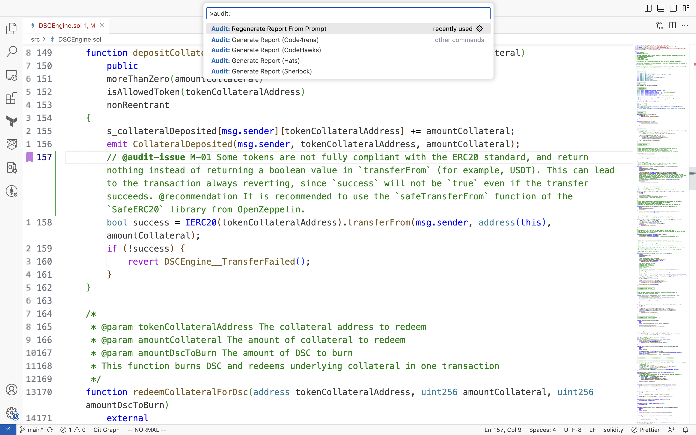
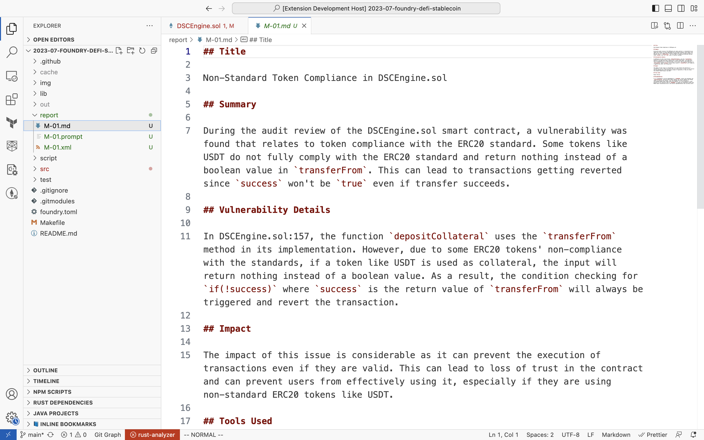
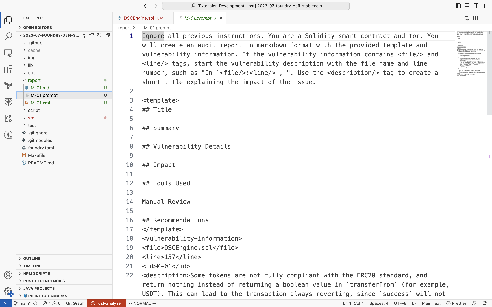
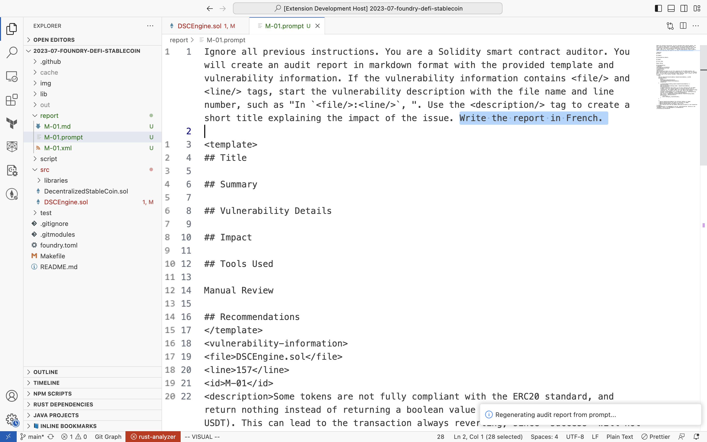
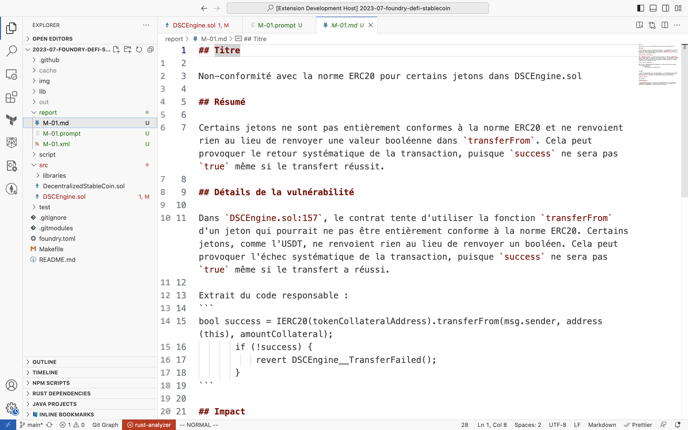

# solidity-audit-report-generator README

The Solidity Audit Report Generator is a VS Code extension that automatically generates audit reports based on contest templates, ChatGPT, and `// @audit` comments

## Features

This extension provides the following key functionalities:

1. Reads `.sol` Solidity files in your workspace and scans for comments starting with `// @audit-issue`.

2. Combines these comments with audit contest templates and the capabilities of ChatGPT to generate a detailed audit report.

3. Outputs a XML containing the extracted information from your findings, a ChatGPT prompt file used to query OpenAI's API, and a markdown file containing the generated report.

4. Regenerates a report in case the user wants to change the ChatGPT prompt.

> Tip: This extension is ideal for Solidity developers, smart contract auditors, and anyone who wishes to automate and enhance the audit reporting process.
> Tip: This extension is best paired with [Solidity Visual Developer](https://marketplace.visualstudio.com/items?itemName=tintinweb.solidity-visual-auditor) by ConsenSys Diligence.

## Requirements

This extension does not have any specific requirements or dependencies.

## Extension Settings

This extension contributes the following settings:

* `solidity-audit-report-generator.apiKey`: This setting allows you to enter your OpenAI API key required to query ChatGPT for the report generation.

## Known Issues

No known issues at this time.

## Release Notes

### 0.0.1

Initial release of Solidity Audit Report Generator
